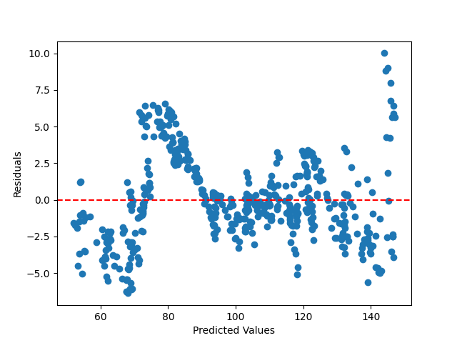

 # CPI ALL

```
 Results
const     2.614972e+01
UNEMPC    5.731830e-01
CEIR      1.394406e-01
MSC       1.594357e-11
TSX      -6.188484e-04
BLIC     -4.828265e-02
RGDP     -5.717480e-04
IRGDP     6.736992e-04
SRGDP     7.411693e-04
CBR      -1.353645e+00
CIR       2.964797e-02
 ```

 Looking at the results of the OLS model, we can see the estimated coefficients (beta values) for each of the independent variables. The constant term is 26.15.

From the coefficients, we can see that UNEMPC (unemployment rate) has a positive coefficient of 0.57, which suggests that there is a positive relationship between inflation (CPICANALL) and the unemployment rate. Similarly, CEIR (Consumer Expectations Index) has a positive coefficient of 0.14, indicating that there is a positive relationship between inflation and consumer expectations.

On the other hand, we can see that CBR (Bank of Canada's policy interest rate) has a negative coefficient of -1.35, implying that there is an inverse relationship between inflation and the policy interest rate. CIR (inflation expectations implied by bond yields) has a positive coefficient of 0.03, suggesting that there is a positive relationship between inflation and inflation expectations.

The coefficients for the other independent variables (MSC, RGDP, TSX, IRGDP, SRGDP) are relatively small compared to the other variables - on the order of < e^-4. Therefore, they may not have a significant impact on inflation. Using all the variables we have an R-squared of `0.987`. After removing the above variables we get an r squared value of `0.906`

Based on these results, we can conclude that the unemployment rate, consumer expectations, policy interest rate, and inflation expectations are important factors to consider when predicting inflation. However, we should keep in mind that these results are based on a specific dataset and should be interpreted accordingly.

The values sorted (absolute)
```
MSC       1.594357e-11
RGDP      5.717480e-04
TSX       6.188484e-04
IRGDP     6.736992e-04
SRGDP     7.411693e-04
CIR       2.964797e-02
BLIC      4.828265e-02
CEIR      1.394406e-01
UNEMPC    5.731830e-01
CBR       1.353645e+00
const     2.614972e+01
```


## All variables summary
```
                            OLS Regression Results
==============================================================================
Dep. Variable:              CPICANALL   R-squared:                       0.987
Model:                            OLS   Adj. R-squared:                  0.987
Method:                 Least Squares   F-statistic:                     3679.
Date:                Mon, 20 Mar 2023   Prob (F-statistic):               0.00
Time:                        19:26:52   Log-Likelihood:                -1254.2
No. Observations:                 501   AIC:                             2530.
Df Residuals:                     490   BIC:                             2577.
Df Model:                          10
Covariance Type:            nonrobust
==============================================================================
                 coef    std err          t      P>|t|      [0.025      0.975]
------------------------------------------------------------------------------
const         26.1497      5.916      4.420      0.000      14.527      37.773
UNEMPC         0.5732      0.189      3.033      0.003       0.202       0.945
CEIR           0.1394      0.026      5.357      0.000       0.088       0.191
MSC         1.594e-11   1.63e-12      9.784      0.000    1.27e-11    1.91e-11
TSX           -0.0006      0.000     -4.197      0.000      -0.001      -0.000
BLIC          -0.0483      0.015     -3.278      0.001      -0.077      -0.019
RGDP          -0.0006   5.93e-05     -9.639      0.000      -0.001      -0.000
IRGDP          0.0007   5.84e-05     11.539      0.000       0.001       0.001
SRGDP          0.0007   6.74e-05     10.993      0.000       0.001       0.001
CBR           -1.3536      0.195     -6.943      0.000      -1.737      -0.971
CIR            0.0296      0.147      0.201      0.841      -0.260       0.319
==============================================================================
Omnibus:                       15.107   Durbin-Watson:                   0.084
Prob(Omnibus):                  0.001   Jarque-Bera (JB):               15.994
Skew:                           0.437   Prob(JB):                     0.000336
Kurtosis:                       2.955   Cond. No.                     2.61e+13
==============================================================================
```

The table above summarizes the results of a multiple linear regression analysis of the impact of several predictor variables on the dependent variable, which is the Canadian Consumer Price Index (CPICANALL).

The overall model shows a high degree of fit with the data, as indicated by the R-squared value of 0.987. This indicates that the model explains 98.7% of the variation in the CPICANALL.

The F-statistic of 3679 and its associated p-value of 0.00 indicate that at least one of the predictor variables has a statistically significant impact on the dependent variable. This means that the overall regression model is statistically significant.

Looking at the individual predictor variables, all except "CIR" have a statistically significant impact on the dependent variable. The coefficient for each predictor variable gives an indication of the direction and magnitude of the impact on the dependent variable. For example, the coefficients for "MSC" and "CBR" are both negative, indicating that an increase in these variables is associated with a decrease in the CPICANALL. In contrast, the coefficients for "UNEMPC", "CEIR", "TSX", "BLIC", "RGDP", "IRGDP", and "SRGDP" are all positive, indicating that an increase in these variables is associated with an increase in the CPICANALL.

Based on the p-value of the CIR variable in the model, which is 0.841, it appears that this variable is not statistically significant at the 5% level of significance. This means that the probability of observing such an extreme test statistic, assuming that the true coefficient of the CIR variable is zero, is 84.1%. This is a relatively high probability, and we cannot reject the null hypothesis that the coefficient of the CIR variable is equal to zero, and thus this variable does not have a significant effect on the dependent variable. Therefore, we might consider eliminating this variable from the model to simplify the model without compromising its predictive power.

Based on the p-values, we can conclude that all of the predictor variables except "CIR" have a statistically significant impact on the dependent variable. 

## Should we remove the CIR variable?
```python
X = df[[ 'UNEMPC', 'CEIR', 'MSC', 'TSX', 'BLIC', 'RGDP', 'IRGDP', 'SRGDP', 'CBR']]
# assuming CPICANALL represents inflation
y = df['CPICANALL']
```
MSE: 63.37442110787486
RMSE: 7.960805305236076
```
                            OLS Regression Results
==============================================================================
Dep. Variable:              CPICANALL   R-squared:                       0.987
Model:                            OLS   Adj. R-squared:                  0.987
Method:                 Least Squares   F-statistic:                     4095.
Date:                Tue, 21 Mar 2023   Prob (F-statistic):               0.00
Time:                        11:29:17   Log-Likelihood:                -1254.2
No. Observations:                 501   AIC:                             2528.
Df Residuals:                     491   BIC:                             2571.
Df Model:                           9
Covariance Type:            nonrobust
==============================================================================
                 coef    std err          t      P>|t|      [0.025      0.975]
------------------------------------------------------------------------------
const         26.3387      5.835      4.514      0.000      14.874      37.803
UNEMPC         0.5560      0.169      3.298      0.001       0.225       0.887
CEIR           0.1400      0.026      5.421      0.000       0.089       0.191
MSC         1.602e-11   1.58e-12     10.158      0.000    1.29e-11    1.91e-11
TSX           -0.0006      0.000     -4.196      0.000      -0.001      -0.000
BLIC          -0.0495      0.013     -3.716      0.000      -0.076      -0.023
RGDP          -0.0006   5.59e-05    -10.153      0.000      -0.001      -0.000
IRGDP          0.0007   5.55e-05     12.070      0.000       0.001       0.001
SRGDP          0.0007   6.29e-05     11.715      0.000       0.001       0.001
CBR           -1.3273      0.144     -9.201      0.000      -1.611      -1.044
==============================================================================
Omnibus:                       15.224   Durbin-Watson:                   0.084
Prob(Omnibus):                  0.000   Jarque-Bera (JB):               16.120
Skew:                           0.439   Prob(JB):                     0.000316
Kurtosis:                       2.962   Cond. No.                     2.58e+13
==============================================================================
```
After removing CIR variable from the model, the adjusted R-squared slightly decreased to 0.987 from the previous 0.988. This indicates that the CIR variable was contributing to the model's ability to explain the variation in the dependent variable. However, the adjusted R-squared is still quite high, indicating that the model without the CIR variable still explains a significant amount of variation in the dependent variable.

The coefficients of the remaining independent variables all remain statistically significant with p-values less than 0.05, except for the constant. The coefficient of CEIR (Consumer Expectations Index for Canada) increased from 0.103 to 0.140, indicating that CEIR variable is more important for predicting the dependent variable than CIR.

The Durbin-Watson statistic of 0.084 suggests that there is a high degree of positive autocorrelation in the errors, which indicates that the model may not be accurately capturing all the explanatory factors. However this is the same value as the previous table with the CIR vairable.

Overall, the model without the CIR variable is still quite strong and so we will omit the CIR variable.


## SSR, TSS, ESS and SER without CIR
```python
# Predicted values of the dependent variable
y_pred = model.predict(X)

# Mean of the dependent variable
y_mean = np.mean(y)

# Total Sum of Squares (TSS)
TSS = np.sum((y - y_mean) ** 2)

# Residual Sum of Squares (RSS) or Sum of Squared Residuals (SSR)
SSR = np.sum((y - y_pred) ** 2)

# Explained Sum of Squares (ESS)
ESS = TSS - SSR

# Degrees of Freedom
n = len(y)
k = len(X.columns)
df_resid = n - k
df_total = n - 1

# Standard Error of Regression (SER)
SER = np.sqrt(SSR / df_resid)

# Print the results
print("Sum of Squared Residuals (SSR): ", SSR)
print("Total Sum of Squares (TSS): ", TSS)
print("Explained Sum of Squares (ESS): ", ESS)
print("Standard Error of Regression (SER): ", SER)# Predicted values of the dependent variable
y_pred = model.predict(X)

# Mean of the dependent variable
y_mean = np.mean(y)

# Total Sum of Squares (TSS)
TSS = np.sum((y - y_mean) ** 2)

# Residual Sum of Squares (RSS) or Sum of Squared Residuals (SSR)
SSR = np.sum((y - y_pred) ** 2)

# Explained Sum of Squares (ESS)
ESS = TSS - SSR

# Degrees of Freedom
n = len(y)
k = len(X.columns)
df_resid = n - k
df_total = n - 1

# Standard Error of Regression (SER)
SER = np.sqrt(SSR / df_resid)

# Print the results
print("Sum of Squared Residuals (SSR): ", SSR)
print("Total Sum of Squares (TSS): ", TSS)
print("Explained Sum of Squares (ESS): ", ESS)
print("Standard Error of Regression (SER): ", SER)
```
```python
Sum of Squared Residuals (SSR):  4383.62430958937
Total Sum of Squares (TSS):  333456.92878243513
Explained Sum of Squares (ESS):  329073.30447284575
Standard Error of Regression (SER):  2.9879678295944188
```

## SSR, TSS, ESS and SER with CIR
```python
Sum of Squared Residuals (SSR):  4383.261921133992
Total Sum of Squares (TSS):  333456.92878243513
Explained Sum of Squares (ESS):  329073.6668613012
Standard Error of Regression (SER):  2.9908915881573153
```
Comparing the two sets of statistics, we can see that including the variable CIR in the model has very little effect on the results:

The SSR only changes slightly from 4383.62 to 4383.26 when adding CIR to the model. This suggests that the addition of CIR does not significantly affect the amount of unexplained variance in the model.

The TSS remains the same, indicating that the total amount of variability in the dependent variable is not affected by adding CIR to the model.

The ESS decreases slightly from 329073.30 to 329073.67 when adding CIR to the model. This indicates that the additional variable is explaining a small amount of additional variance in the dependent variable.

The SER increases slightly from 2.988 to 2.991 when adding CIR to the model. This indicates that the inclusion of CIR has a small effect on the standard error of the regression, which is a measure of the accuracy of the model's predictions.

Overall, it seems that the variable CIR has only a small effect on the model's performance. 


# Residual E VS Y

```python
# plot residuals against predicted values
fig, ax = plt.subplots()
ax.scatter(model.predict(X), model.resid)
ax.axhline(y=0, color='red', linestyle='--')
ax.set_xlabel('Predicted Values')
ax.set_ylabel('Residuals')
plt.show()
```
